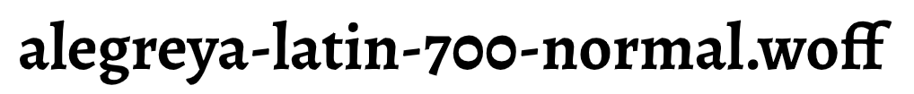
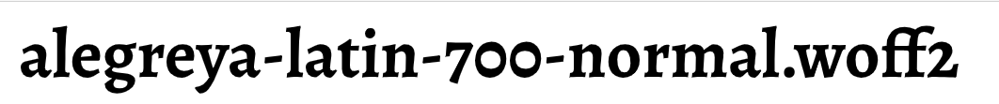
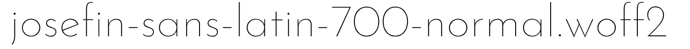

# @fontsource Josefin WOFF2 Bug

All WOFF2s in Josefin Sans are the 100-weight font.

To run this test, `ln -s /path/to/fontsource-repo-clone ./fontsource; yarn go`.

You'll get a bunch of outputs in `results/` which contain SVGs based off the WOFFs
and WOFF2s of Alegreya, which is fine, and Josefin Sans, which is fine in WOFF
format, but all the 100-weight versions in WOFF2, eg:

